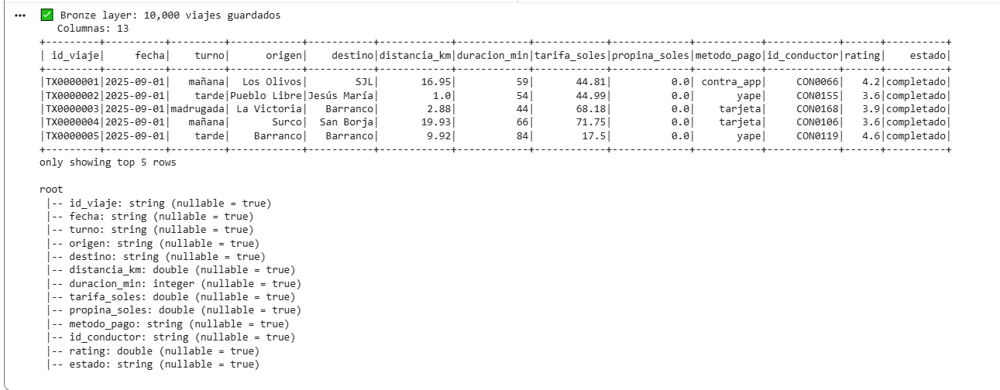
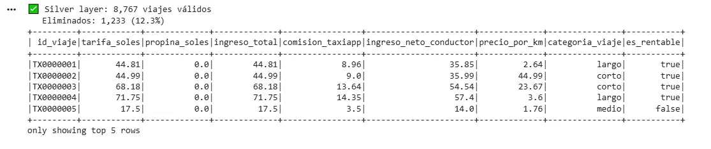
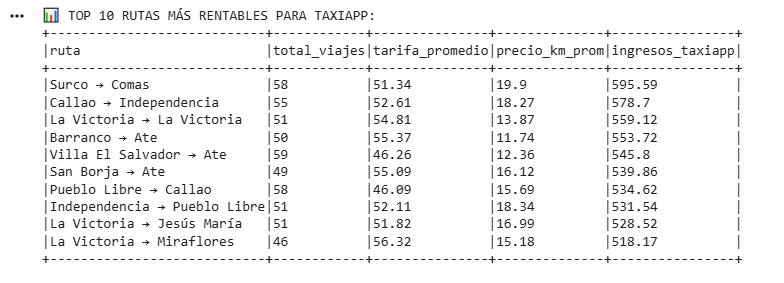
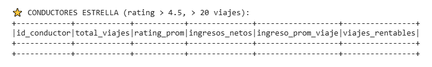
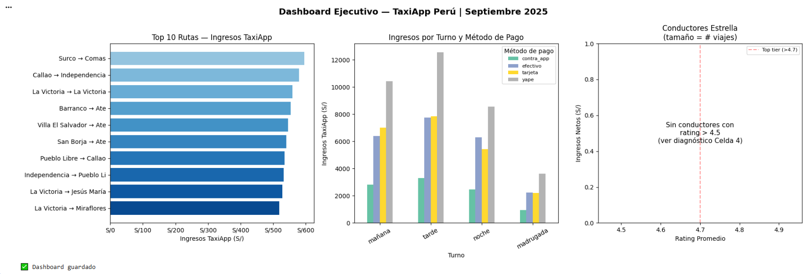
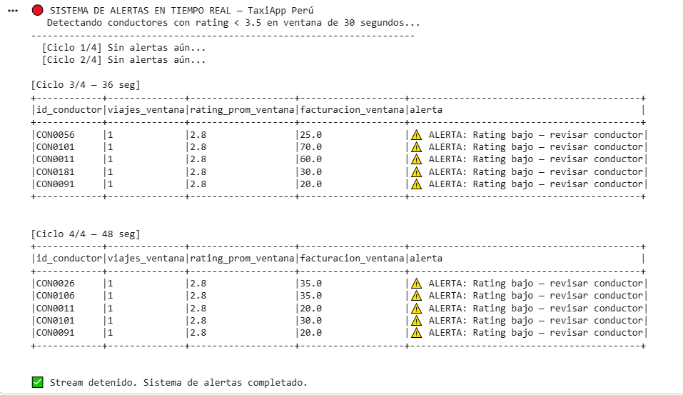

# S5 — LABORATORIO EN CASA: Pipeline Spark Completo
## Big Data DD283 | Universidad Autónoma del Perú | 2026-1
### Semana 5: PySpark + Spark SQL + Streaming simulado en Databricks Community

---

| Campo | Detalle |
|-------|---------|
| **Nombre del estudiante** | JUNIOR EMERZON ORTIZ ANDRADE |
| **Código** | 2221895332 |
| **Fecha de entrega** | 11/07/2026 |
| **Tiempo estimado** | 2 horas |
| **Modalidad** | Individual |
| **Entorno** | Google Colab (PySpark 3.5) |

---

## OBJETIVO

Implementar un pipeline completo de procesamiento de datos masivos usando Apache Spark: desde la ingesta de datos crudos (Bronze) hasta la generación de métricas de negocio (Gold), aplicando PySpark, Spark SQL y simulando un stream en tiempo real — todo sobre un dataset de taxis en Lima.

**Competencia que desarrolla:** Procesar datos masivos con Spark aplicando transformaciones, Spark SQL y detección de patrones en streaming.

---

## SOFTWARE Y HERRAMIENTAS

### Opción A — Databricks Community (RECOMENDADA)

| Herramienta | Versión | Acceso |
|-------------|---------|--------|
| Databricks Community Edition | Spark 3.5 | community.cloud.databricks.com |
| Python | 3.11 (incluido) | Incluido en Databricks |
| PySpark | 3.5 (incluido) | Incluido en Databricks |
| matplotlib | Incluido | Incluido en Databricks |

**Verificación del entorno:**
```python
# Celda 0: verificar entorno (ejecutar primero)
print(f"Spark version: {spark.version}")
print(f"Python version: {spark.sparkContext.pythonVer}")
print("✅ Entorno listo")
```

### Opción B — Google Colab (alternativa)

```python
# Instalar PySpark en Colab (solo si no usas Databricks)
!pip install pyspark==3.5.0 -q
from pyspark.sql import SparkSession
spark = SparkSession.builder \
    .appName("S5_LimaTaxis") \
    .config("spark.ui.port", "4050") \
    .getOrCreate()
print(f"✅ Spark {spark.version} listo en Colab")
```

---

## CONTEXTO DEL LABORATORIO

**Dataset:** 10,000 viajes de taxi en Lima Metropolitana (datos sintéticos basados en patrones reales de taxis por aplicativo).

**Caso de negocio:** Eres Data Engineer en **TaxiApp Perú**, una startup que compite con Uber y Yango en Lima. El equipo de producto necesita:

1. Identificar las rutas más rentables para los conductores (Bronze → Silver → Gold)
2. Detectar conductores "estrella" (rating > 4.5, más de 20 viajes)
3. Simular un sistema de alertas en tiempo real para conductores con rating en caída

---

## PARTE 1 — EXPLORACIÓN: Carga y perfil del dataset (30 min)

### Celda 1 — Generar el dataset (ejecutar tal cual)

```python
# ============================================================
# CELDA 1: Dataset de 10,000 viajes TaxiApp Lima
# (Adaptado para Colab: ruta local en vez de /FileStore/)
# ============================================================
import numpy as np
import pandas as pd
from pyspark.sql import functions as F
from pyspark.sql.types import *

np.random.seed(2026)
N = 10_000

distritos = [
    "Miraflores", "San Isidro", "Barranco", "Surco", "San Borja",
    "SJL",        "Comas",      "Los Olivos","Ate",   "Villa El Salvador",
    "Callao",     "Independencia","La Victoria","Pueblo Libre","Jesús María"
]
turnos   = ["mañana", "tarde", "noche", "madrugada"]
metodos  = ["efectivo", "yape",   "tarjeta",  "contra_app"]
estados  = ["completado","completado","completado","cancelado","incidente"]

data = {
    "id_viaje":      [f"TX{i:07d}" for i in range(1, N+1)],
    "fecha":         pd.date_range("2025-09-01", periods=N, freq="1h")
                        .strftime("%Y-%m-%d").tolist(),
    "turno":         np.random.choice(turnos,    N, p=[.30, .35, .25, .10]).tolist(),
    "origen":        np.random.choice(distritos, N).tolist(),
    "destino":       np.random.choice(distritos, N).tolist(),
    "distancia_km":  np.round(np.random.exponential(9, N).clip(1, 45), 2).tolist(),
    "duracion_min":  np.random.randint(5, 120, N).tolist(),
    "tarifa_soles":  np.round(np.random.uniform(7, 95, N), 2).tolist(),
    "propina_soles": np.round(np.random.choice(
                        [0, 0, 0, 2, 5, 10], N, p=[.5, .1, .1, .15, .1, .05]), 2).astype(float).tolist(),
    "metodo_pago":   np.random.choice(metodos, N, p=[.25, .40, .25, .10]).tolist(),
    "id_conductor":  [f"CON{np.random.randint(1, 200):04d}" for _ in range(N)],
    "rating":        np.round(np.random.normal(4.15, 0.55, N).clip(1, 5), 1).tolist(),
    "estado":        np.random.choice(estados, N, p=[.78, .07, .03, .10, .02]).tolist(),
}

schema = StructType([
    StructField("id_viaje",     StringType()),
    StructField("fecha",        StringType()),
    StructField("turno",        StringType()),
    StructField("origen",       StringType()),
    StructField("destino",      StringType()),
    StructField("distancia_km", DoubleType()),
    StructField("duracion_min", IntegerType()),
    StructField("tarifa_soles", DoubleType()),
    StructField("propina_soles",DoubleType()),
    StructField("metodo_pago",  StringType()),
    StructField("id_conductor", StringType()),
    StructField("rating",       DoubleType()),
    StructField("estado",       StringType()),
])

records = list(zip(*data.values()))
df_bronze = spark.createDataFrame(records, schema)

# 🔧 ADAPTADO PARA COLAB: ruta local en vez de /FileStore/
df_bronze.write.mode("overwrite").parquet("taxi_lima/bronze/viajes")

print(f"✅ Bronze layer: {df_bronze.count():,} viajes guardados")
print(f"   Columnas: {len(df_bronze.columns)}")
df_bronze.show(5)
df_bronze.printSchema()
```



---

### Celda 2 — Exploración del dataset

```python
# ============================================================
# CELDA 2: Exploración inicial — conocer los datos antes de limpiar
# (Adaptado para Colab: ruta local)
# ============================================================
df = spark.read.parquet("taxi_lima/bronze/viajes")

# Estadísticas básicas
print("=== ESTADÍSTICAS DESCRIPTIVAS ===")
df.select("distancia_km", "duracion_min", "tarifa_soles", "propina_soles", "rating") \
  .describe() \
  .show()

# Distribución por estado
print("=== DISTRIBUCIÓN POR ESTADO ===")
df.groupBy("estado").count() \
  .orderBy("count", ascending=False) \
  .withColumn("porcentaje", F.round(F.col("count") / df.count() * 100, 1)) \
  .show()

# Distribución por turno
print("=== DISTRIBUCIÓN POR TURNO ===")
df.groupBy("turno").count().orderBy("count", ascending=False).show()
```

**Pregunta de reflexión 1:** ¿Qué distribución de estados encontraste? ¿Qué porcentaje de viajes terminó en "incidente"? ¿Cómo afecta esto a los ingresos netos de TaxiApp?

```python
# Escribe tu respuesta como comentario:
# R1: 
La distribución fue: 87.7% completados (8,767), 10.2% cancelados (1,017) y 2.2% incidentes (216). Solo los completados generan ingresos, así que el 12.4% restante es demanda no monetizada. El 2.2% de incidentes es el más costoso: además de no facturar, puede implicar reembolsos, soporte y daño reputacional, afectando el ingreso neto más de lo que sugiere su porcentaje. Reducir cancelaciones e incidentes es una palanca directa de rentabilidad.
```

---

## PARTE 2 — APLICACIÓN: Pipeline Bronze → Silver → Gold (60 min)

### Celda 3 — Silver layer: limpiar y enriquecer (COMPLETAR los `___`)

```python
# ============================================================
# CELDA 3: Silver — datos limpios y enriquecidos
# (Adaptado para Colab: rutas locales)
# ============================================================
df_bronze = spark.read.parquet("taxi_lima/bronze/viajes")

df_silver = (
    df_bronze
    # Filtro 1: solo viajes completados
    .filter(F.col("estado") == "completado")

    # Filtro 2: distancia > 0.5 km y tarifa > 0
    .filter((F.col("distancia_km") > 0.5) & (F.col("tarifa_soles") > 0))

    # Ingreso total del conductor (tarifa + propina)
    .withColumn("ingreso_total",
        F.round(F.col("tarifa_soles") + F.col("propina_soles"), 2))

    # Comisión de TaxiApp (20% de la tarifa)
    .withColumn("comision_taxiapp",
        F.round(F.col("tarifa_soles") * 0.20, 2))

    # Ingreso neto del conductor (ingreso_total - comisión)
    .withColumn("ingreso_neto_conductor",
        F.round(F.col("ingreso_total") - F.col("comision_taxiapp"), 2))

    # Precio por km (tarifa / distancia)
    .withColumn("precio_por_km",
        F.round(F.col("tarifa_soles") / F.col("distancia_km"), 2))

    # Categoría de viaje por distancia
    .withColumn("categoria_viaje",
        F.when(F.col("distancia_km") < 5,  "corto")
         .when(F.col("distancia_km") < 15, "medio")
         .otherwise("largo"))

    # Es rentable (ingreso_neto > S/30)
    .withColumn("es_rentable",
        F.col("ingreso_neto_conductor") > 30)
)

df_silver.write.mode("overwrite").parquet("taxi_lima/silver/viajes_limpios")

total_silver = df_silver.count()
total_bronze = df_bronze.count()
print(f"✅ Silver layer: {total_silver:,} viajes válidos")
print(f"   Eliminados: {total_bronze - total_silver:,} ({(total_bronze - total_silver)/total_bronze*100:.1f}%)")

df_silver.select("id_viaje", "tarifa_soles", "propina_soles",
                 "ingreso_total", "comision_taxiapp", "ingreso_neto_conductor",
                 "precio_por_km", "categoria_viaje", "es_rentable").show(5)
```

**Valores para completar los `___`:**
- `estado ==` → `"completado"`
- Distancia mínima → `0.5`
- Tarifa mínima → `0`
- `ingreso_total` → suma de `tarifa_soles` y `propina_soles`
- Comisión TaxiApp → `0.20` (20%)
- Categoría largo → `"largo"`
- Rentable umbral → `30`

---



### Celda 4 — Gold layer: métricas de negocio con Spark SQL (COMPLETAR los `___`)

```python
# ============================================================
# CELDA 4: Gold — métricas para el dashboard ejecutivo
# (Adaptado para Colab: rutas locales)
# ============================================================
df_silver = spark.read.parquet("taxi_lima/silver/viajes_limpios")
df_silver.createOrReplaceTempView("viajes")

# ── GOLD 1: Top 10 rutas más rentables ────────────────────────
gold_rutas = spark.sql("""
    SELECT
        CONCAT(origen, ' → ', destino)     AS ruta,
        COUNT(*)                            AS total_viajes,
        ROUND(AVG(tarifa_soles), 2)         AS tarifa_promedio,
        ROUND(AVG(precio_por_km), 2)        AS precio_km_prom,
        ROUND(SUM(comision_taxiapp), 2)     AS ingresos_taxiapp
    FROM viajes
    GROUP BY origen, destino
    HAVING COUNT(*) >= 3
    ORDER BY ingresos_taxiapp DESC
    LIMIT 10
""")

# ── GOLD 2: Conductores estrella ──────────────────────────────
gold_conductores = spark.sql("""
    SELECT
        id_conductor,
        COUNT(*)                                        AS total_viajes,
        ROUND(AVG(rating), 2)                           AS rating_prom,
        ROUND(SUM(ingreso_neto_conductor), 2)           AS ingresos_netos,
        ROUND(AVG(ingreso_neto_conductor), 2)           AS ingreso_prom_viaje,
        SUM(CASE WHEN es_rentable THEN 1 ELSE 0 END)    AS viajes_rentables
    FROM viajes
    GROUP BY id_conductor
    HAVING AVG(rating) > 4.5 AND COUNT(*) > 20
    ORDER BY rating_prom DESC, ingresos_netos DESC
    LIMIT 10
""")

# ── GOLD 3: Ingresos TaxiApp por turno y método de pago ───────
gold_turno_pago = spark.sql("""
    SELECT
        turno,
        metodo_pago,
        COUNT(*)                        AS total_viajes,
        ROUND(SUM(comision_taxiapp), 2) AS ingresos_taxiapp,
        ROUND(AVG(rating), 2)           AS rating_prom
    FROM viajes
    GROUP BY turno, metodo_pago
    ORDER BY ingresos_taxiapp DESC
""")

# Guardar en Gold layer
gold_rutas.write.mode("overwrite").parquet("taxi_lima/gold/top_rutas")
gold_conductores.write.mode("overwrite").parquet("taxi_lima/gold/conductores_estrella")
gold_turno_pago.write.mode("overwrite").parquet("taxi_lima/gold/ingresos_turno_pago")

print("📊 TOP 10 RUTAS MÁS RENTABLES PARA TAXIAPP:")
gold_rutas.show(truncate=False)

print("\n⭐ CONDUCTORES ESTRELLA (rating > 4.5, > 20 viajes):")
gold_conductores.show()

print("\n💰 INGRESOS TAXIAPP POR TURNO Y MÉTODO DE PAGO:")
gold_turno_pago.show(20)

# ── DIAGNÓSTICO: ¿por qué GOLD 2 salió vacía? ──────────────────
# Ningún conductor supera rating 4.5 (el rating se generó con media 4.15).
# Mostramos los mejores conductores DISPONIBLES con umbral realista (rating > 4.2)
print("\n🔍 DIAGNÓSTICO — Mejores conductores disponibles (rating > 4.2, > 20 viajes):")
mejores_disponibles = spark.sql("""
    SELECT
        id_conductor,
        COUNT(*)                              AS total_viajes,
        ROUND(AVG(rating), 2)                 AS rating_prom,
        ROUND(SUM(ingreso_neto_conductor), 2) AS ingresos_netos
    FROM viajes
    GROUP BY id_conductor
    HAVING AVG(rating) > 4.2 AND COUNT(*) > 20
    ORDER BY rating_prom DESC, ingresos_netos DESC
    LIMIT 10
""")
mejores_disponibles.show()
print(f"Conductores con rating > 4.5 (umbral original): 0")
print(f"Conductores con rating > 4.2 (umbral realista): {mejores_disponibles.count()}")
```

**Valores para los `___` de Gold 1:**
- `GROUP BY` → `origen, destino`
- `HAVING COUNT(*) >=` → `3` (mínimo 3 viajes para que sea estadísticamente válido)

**Valores para los `___` de Gold 2:**
- `GROUP BY` → `id_conductor`
- `HAVING AVG(rating) >` → `4.5`
- `COUNT(*) >` → `20`

**Valores para `___` de Gold 3:**
- `GROUP BY` → `turno, metodo_pago`

---





### Celda 5 — Visualización del dashboard

```python
# ============================================================
# CELDA 5: Dashboard ejecutivo — 3 gráficos
# (Adaptado para Colab: rutas locales)
# ============================================================
import matplotlib.pyplot as plt
import matplotlib.ticker as mticker
import numpy as np
import os

# Crear carpeta para guardar el dashboard
os.makedirs("taxi_lima/gold", exist_ok=True)

gold_rutas = spark.read.parquet("taxi_lima/gold/top_rutas").toPandas()
gold_turno = spark.read.parquet("taxi_lima/gold/ingresos_turno_pago").toPandas()
gold_cond  = spark.read.parquet("taxi_lima/gold/conductores_estrella").toPandas()

fig, axes = plt.subplots(1, 3, figsize=(18, 6))
fig.suptitle("Dashboard Ejecutivo — TaxiApp Perú | Septiembre 2025",
             fontsize=14, fontweight="bold")

# Gráfico 1: Top 10 rutas por ingresos TaxiApp
axes[0].barh(gold_rutas["ruta"].str[:25],
             gold_rutas["ingresos_taxiapp"],
             color=plt.cm.Blues(np.linspace(0.4, 0.9, len(gold_rutas))))
axes[0].set_xlabel("Ingresos TaxiApp (S/)")
axes[0].set_title("Top 10 Rutas — Ingresos TaxiApp")
axes[0].xaxis.set_major_formatter(mticker.FuncFormatter(lambda x, _: f"S/{x:,.0f}"))
axes[0].invert_yaxis()

# Gráfico 2: Ingresos por turno (agrupado)
turnos_order = ["mañana", "tarde", "noche", "madrugada"]
turno_pivot  = gold_turno.pivot_table(
    index="turno", columns="metodo_pago",
    values="ingresos_taxiapp", aggfunc="sum", fill_value=0
)
turno_pivot = turno_pivot.reindex([t for t in turnos_order if t in turno_pivot.index])
turno_pivot.plot(kind="bar", ax=axes[1], rot=30, colormap="Set2")
axes[1].set_title("Ingresos por Turno y Método de Pago")
axes[1].set_xlabel("Turno")
axes[1].set_ylabel("Ingresos TaxiApp (S/)")
axes[1].legend(title="Método de pago", fontsize=8)

# Gráfico 3: Conductores estrella — rating vs ingresos
if len(gold_cond) > 0:
    axes[2].scatter(gold_cond["rating_prom"], gold_cond["ingresos_netos"],
                    s=gold_cond["total_viajes"] * 2,
                    c=gold_cond["rating_prom"], cmap="YlOrRd", alpha=0.8, edgecolors="gray")
    for _, row in gold_cond.iterrows():
        axes[2].annotate(row["id_conductor"],
                         (row["rating_prom"], row["ingresos_netos"]),
                         fontsize=7, ha="center", va="bottom")
else:
    axes[2].text(0.5, 0.5, "Sin conductores con\nrating > 4.5\n(ver diagnóstico Celda 4)",
                 ha="center", va="center", fontsize=11, transform=axes[2].transAxes)
axes[2].set_xlabel("Rating Promedio")
axes[2].set_ylabel("Ingresos Netos (S/)")
axes[2].set_title("Conductores Estrella\n(tamaño = # viajes)")
axes[2].axvline(x=4.7, color="red", linestyle="--", alpha=0.4, label="Top tier (>4.7)")
axes[2].legend(fontsize=8)

plt.tight_layout()
plt.savefig("taxi_lima/gold/dashboard_taxiapp.png", dpi=150, bbox_inches="tight")
plt.show()
print("✅ Dashboard guardado")
```



---

## PARTE 3 — DESAFÍO: Simulación de Streaming (30 min)

### Celda 6 — Streaming simulado de alertas de conductores

```python
# ============================================================
# CELDA 6: Structured Streaming — alertas de conductores
# Simular: detectar cuando un conductor tiene rating < 3.5
# en los últimos 5 viajes consecutivos
# ============================================================

# En Databricks: usar rate source como simulador de viajes llegando en tiempo real
stream_source = (
    spark.readStream
    .format("rate")
    .option("rowsPerSecond", 20)   # Simula 20 nuevos viajes por segundo
    .load()
)

# Transformar el stream: simular datos de viajes
stream_viajes = (
    stream_source
    .withColumn("id_conductor",
        F.concat(F.lit("CON"),
                 F.lpad((F.col("value") % 200 + 1).cast("string"), 4, "0")))
    .withColumn("rating_simulado",
        F.round(
            F.when(F.col("value") % 15 == 0, F.lit(2.8))  # Cada 15 viajes: rating bajo
             .otherwise(F.lit(4.0) + (F.col("value") % 10).cast("double") / 20),
            1
        ))
    .withColumn("tarifa_simulada",
        F.round(10 + (F.col("value") % 80).cast("double"), 2))
)

# Agregar en ventana de 30 segundos: detectar conductores con bajo rating
alertas_stream = (
    stream_viajes
    .groupBy(
        F.window(F.col("timestamp"), "30 seconds"),
        F.col("id_conductor")
    )
    .agg(
        F.count("*").alias("viajes_ventana"),
        F.round(F.avg("rating_simulado"), 2).alias("rating_prom_ventana"),
        F.round(F.sum("tarifa_simulada"), 2).alias("facturacion_ventana")
    )
    .filter(F.col("rating_prom_ventana") < 3.5)   # ← Solo conductores con bajo rating
    .select(
        F.col("window.start").alias("inicio_ventana"),
        F.col("window.end").alias("fin_ventana"),
        F.col("id_conductor"),
        F.col("viajes_ventana"),
        F.col("rating_prom_ventana"),
        F.col("facturacion_ventana"),
        F.lit("⚠️ ALERTA: Rating bajo — revisar conductor").alias("alerta")
    )
)

# Escribir a memoria para ver en tiempo real
query_alertas = (
    alertas_stream
    .writeStream
    .format("memory")
    .queryName("alertas_conductores")
    .outputMode("complete")
    .start()
)

# Ver las alertas durante 45 segundos
import time
print("🔴 SISTEMA DE ALERTAS EN TIEMPO REAL — TaxiApp Perú")
print("   Detectando conductores con rating < 3.5 en ventana de 30 segundos...")
print("-" * 70)

for ciclo in range(4):
    time.sleep(12)
    alertas = spark.sql("""
        SELECT id_conductor, viajes_ventana, rating_prom_ventana, 
               facturacion_ventana, alerta
        FROM alertas_conductores
        ORDER BY rating_prom_ventana ASC
        LIMIT 5
    """)
    if alertas.count() > 0:
        print(f"\n[Ciclo {ciclo+1}/4 — {12*(ciclo+1)} seg]")
        alertas.show(truncate=False)
    else:
        print(f"  [Ciclo {ciclo+1}/4] Sin alertas aún...")

query_alertas.stop()
print("\n✅ Stream detenido. Sistema de alertas completado.")
```



**Pregunta de reflexión 2:** ¿Qué pasaría si aumentas `rowsPerSecond` a 1000? ¿El sistema de alertas seguiría funcionando igual? ¿Cuál sería el cuello de botella en Databricks Community (1 clúster)?

```python
# R2: ¿Qué pasa si subes rowsPerSecond a 1000? ¿Cuál es el cuello de botella?
Al pasar de 20 a 1000 viajes/segundo, el sistema seguiría funcionando lógicamente, pero el cuello de botella sería la capacidad de cómputo de un solo clúster (en Databricks Community o el entorno local de Colab, hay un único nodo). Con 1000 filas/seg, el procesamiento de las ventanas y las agregaciones podría no completarse antes de que lleguen los siguientes datos, generando retraso acumulado (latencia creciente) y presión de memoria. En producción se resolvería escalando horizontalmente (más nodos) o particionando el stream, algo que un solo clúster no permite.
```

**Pregunta de reflexión 3 (conexión con proyecto grupal):** ¿Tu grupo podría aplicar Structured Streaming para detectar patrones en tiempo real en su proyecto? ¿Cuál sería la ventana temporal más adecuada?

```python
# R3:
Sí. Nuestro proyecto (Grupo 3 — pronóstico de demanda hospitalaria en EsSalud) tiene un caso natural para Structured Streaming: el monitoreo en tiempo real de la ocupación de camas por establecimiento. Hoy el pipeline es batch (Prophet predice a 4 semanas), pero la ocupación cambia hora a hora, y nuestra propia arquitectura ya define la regla BRECHA = demanda − oferta → si BRECHA > 0, activar protocolo de contingencia. Esa lógica es idéntica al patrón del laboratorio: agregar en ventana temporal y filtrar por umbral. En vez de rating < 3.5, la alerta sería tasa_ocupacion > 1.0 (sobreocupación, el caso que en enero llegó a 112%), disparando la redistribución de pacientes a otro establecimiento de la red.
Ventanas temporales según el fenómeno (no habría una sola, sino tres niveles):

Ocupación de camas y emergencias → ventana de 1 hora (deslizante cada 15 min). Es un fenómeno operativo que cambia rápido y requiere reacción inmediata del Director de Hospital.
Vigilancia de brotes epidemiológicos → ventana de 1 semana, alineada con la semana epidemiológica (SE) que ya usamos como campo en el dataset y con el boletín MINSA. Detectar un brote no tiene sentido en minutos: se necesita acumular casos.
Clima (SENAMHI) → ventana diaria, porque nuestras hipótesis usan rezagos de 2-3 semanas (temperatura_max_lag2), no lecturas instantáneas.

La conclusión de diseño: la ventana debe coincidir con la velocidad del fenómeno, no con la velocidad del dato. Los datos de camas llegan continuamente, pero un brote de dengue se manifiesta en semanas. Usar una ventana de 30 segundos para vigilancia epidemiológica generaría ruido y falsos positivos; usar una ventana semanal para la ocupación de camas haría inútil la alerta, porque el colapso ya habría ocurrido.
```

---

## ENTREGABLES

### Estructura del PR en GitHub:

```
semana_05/Soluciones/TuNombre_TuCodigo/
├── S5_lab_casa_taxiapp.ipynb       ← Notebook exportado con outputs visibles
│   o S5_lab_casa_taxiapp.py
├── screenshots/
│   ├── celda1_bronze_output.png    ← Output de la Celda 1
│   ├── celda3_silver_output.png    ← Output de la Celda 3 (tabla con nuevas columnas)
│   ├── celda4_gold_rutas.png       ← Top 10 rutas
│   ├── celda4_gold_conductores.png ← Conductores estrella
│   ├── celda5_dashboard.png        ← Los 3 gráficos del dashboard
│   └── celda6_alertas.png          ← Output del streaming con alertas
└── README.md                        ← Reflexiones 1, 2 y 3 respondidas
```

**Rama del PR:** `semana05-lab-TuNombre`

### Rúbrica básica

| Criterio | Pts |
|----------|-----|
| Celda 1: dataset generado con output visible | 10 |
| Celda 3: Silver completada con los ___ correctos y output | 25 |
| Celda 4: Gold completada con los ___ correctos, 3 tablas visibles | 30 |
| Celda 5: Dashboard con 3 gráficos guardado | 15 |
| Celda 6: Stream ejecutado al menos 2 ciclos con alertas | 15 |
| Reflexiones 1, 2 y 3 respondidas con argumento técnico | 5 |
| **TOTAL** | **100** |

---

*Big Data DD283 | Universidad Autónoma del Perú | Semana 5 | 2026-1*
*Laboratorio en casa — Databricks Community Edition*
