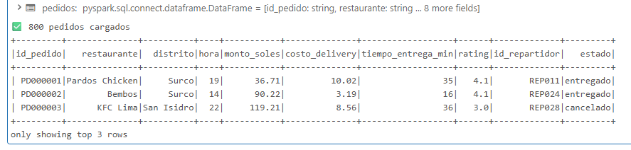
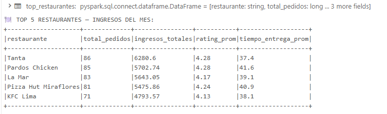
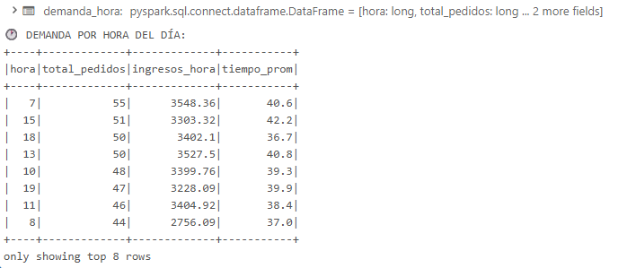
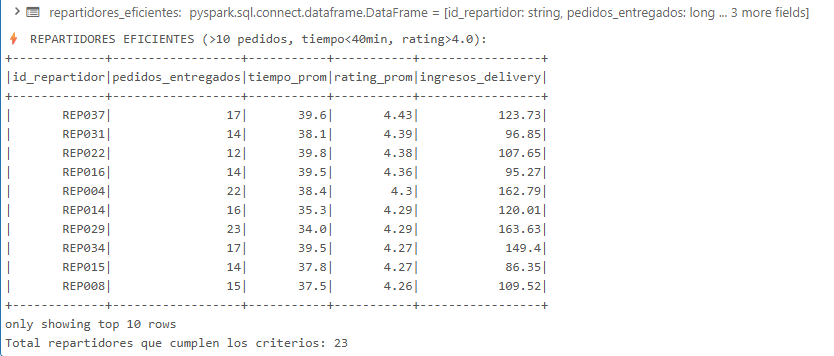

# S5 — LABORATORIO DE CLASE: Spark SQL en Acción

## Big Data DD283 | Universidad Autónoma del Perú | 2026-1

### Semana 5: Consultas Spark SQL sobre datos de Delivery Lima

---

> **Este laboratorio se realiza DURANTE la clase bajo supervisión del docente**
> **Tiempo: 35 minutos | Individual**
> **Herramienta: Databricks Community Edition o Google Colab**

---

| Campo                     | Detalle                             |
| ------------------------- | ----------------------------------- |
| **Nombre del estudiante** | JUNIOR EMERZON ORTIZ ANDRADE        |
| **Código**                | 2221895332                          |
| **Fecha**                 | 04/07/2026                          |
| **Herramienta**           | Databricks Community / Google Colab |
| **Tiempo**                | 35 minutos                          |

---

## ACCESO AL ENTORNO (2 minutos)

**Databricks:** community.cloud.databricks.com → tu cuenta → New Notebook → Python → nombrar `S5_Lab_Clase`

**Google Colab (si no tienes Databricks activo):**

```python
!pip install pyspark -q
from pyspark.sql import SparkSession
spark = SparkSession.builder.appName("S5Clase").getOrCreate()
print(f"✅ Spark {spark.version}")
```

---

## CONTEXTO

Eres analista de datos en **PidelitoApp**, una plataforma de delivery que compite con Rappi en Lima. El Director de Operaciones necesita en 30 minutos un reporte de los 5 mejores restaurantes del mes, las horas de mayor demanda y los repartidores más eficientes.

---

## PASO 1 — Cargar el dataset (5 min)

```python
# ============================================================
# CELDA 1: Dataset de pedidos PidelitoApp Lima
# Ejecutar tal cual — no modificar
# ============================================================
import numpy as np
from pyspark.sql import functions as F
from pyspark.sql.types import *

np.random.seed(42)
N = 800

restaurantes = ["La Mar", "Tanta", "Astrid & Gastón", "El Hornero",
                "Bembos", "KFC Lima", "Pardos Chicken", "Sushi Pop",
                "Cevichería Isolina", "Pizza Hut Miraflores"]
distritos    = ["Miraflores","San Isidro","Barranco","Surco","San Borja",
                "Los Olivos","Ate","SJL","Callao","Villa El Salvador"]
estados      = ["entregado","entregado","entregado","cancelado","en_camino"]

pedidos = spark.createDataFrame([
    (f"PD{i:06d}",
     np.random.choice(restaurantes),
     np.random.choice(distritos),
     int(np.random.randint(7, 23)),
     float(round(np.random.uniform(18, 120), 2)),
     float(round(np.random.uniform(3, 12), 2)),
     int(np.random.randint(15, 65)),
     float(round(np.random.normal(4.2, 0.5), 1)),
     f"REP{np.random.randint(1,40):03d}",
     str(np.random.choice(estados, p=[.75,.08,.05,.10,.02])))
    for i in range(1, N+1)
], ["id_pedido","restaurante","distrito","hora","monto_soles",
    "costo_delivery","tiempo_entrega_min","rating","id_repartidor","estado"])

pedidos.createOrReplaceTempView("pedidos")
print(f"✅ {pedidos.count()} pedidos cargados")
pedidos.show(3)
```

**PUNTO DE VERIFICACIÓN 1:** ¿Ves "800 pedidos cargados" con 10 columnas? → Continúa.



---

## PASO 2 — Consultas Spark SQL (20 min)

```python
# ============================================================
# CELDA 2: Consulta 1 — Top 5 restaurantes por ingresos
# SQL: SELECT restaurante, COUNT, SUM(monto), AVG(rating)
#      WHERE estado = 'entregado'
#      GROUP BY restaurante
#      ORDER BY ingresos DESC LIMIT 5
# ============================================================

top_restaurantes = spark.sql("""
    SELECT
        restaurante,
        COUNT(*)                        AS total_pedidos,
        ROUND(SUM(monto_soles), 2)      AS ingresos_totales,
        ROUND(AVG(rating), 2)           AS rating_prom,
        ROUND(AVG(tiempo_entrega_min),1)AS tiempo_entrega_prom
    FROM pedidos
    WHERE estado = 'entregado'
    GROUP BY restaurante
    ORDER BY ingresos_totales DESC
    LIMIT 5
""")

print("🍽️ TOP 5 RESTAURANTES — INGRESOS DEL MES:")
top_restaurantes.show(truncate=False)
```



```python
# ============================================================
# CELDA 3: ▶ TU TURNO — Consulta 2: Demanda por hora
# COMPLETA los ___ para responder:
# "¿A qué hora del día hay más pedidos y mayor ingreso?"
# ============================================================

demanda_hora = spark.sql("""
    SELECT
        hora,
        COUNT(*)                          AS total_pedidos,
        ROUND(SUM(monto_soles), 2)        AS ingresos_hora,
        ROUND(AVG(tiempo_entrega_min), 1) AS tiempo_prom
    FROM pedidos
    WHERE estado = 'entregado'
    GROUP BY hora
    ORDER BY total_pedidos DESC
""")

print("🕐 DEMANDA POR HORA DEL DÍA:")
demanda_hora.show(8)
```

_Pistas:_

- \_`SUM(___)` → suma de `monto_soles`\_
- \_`WHERE ___ = 'entregado'` → el campo `estado`\_
- \_`GROUP BY ___` → la columna `hora`\_
- \_`ORDER BY total_pedidos ___` → `DESC` para ordenar de mayor a menor\_

---



```python
# ============================================================
# CELDA 4: ▶ TU TURNO — Consulta 3: Repartidores eficientes
# COMPLETA el pipeline para encontrar repartidores con:
# - Más de 10 pedidos entregados
# - Tiempo promedio de entrega < 40 min
# - Rating > 4.0
# ============================================================

repartidores_eficientes = spark.sql("""
    SELECT
        id_repartidor,
        COUNT(*)                          AS pedidos_entregados,
        ROUND(AVG(tiempo_entrega_min), 1) AS tiempo_prom,
        ROUND(AVG(rating), 2)             AS rating_prom,
        ROUND(SUM(costo_delivery), 2)     AS ingresos_delivery
    FROM pedidos
    WHERE estado = 'entregado'
    GROUP BY id_repartidor
    HAVING COUNT(*) > 10
       AND AVG(tiempo_entrega_min) < 40
       AND AVG(rating) > 4.0
    ORDER BY rating_prom DESC
""")

print("⚡ REPARTIDORES EFICIENTES (>10 pedidos, tiempo<40min, rating>4.0):")
repartidores_eficientes.show(10)
print(f"Total repartidores que cumplen los criterios: {repartidores_eficientes.count()}")
```

_Pistas:_

- \_`WHERE estado = ___` → `'entregado'`\_
- \_`GROUP BY ___` → `id_repartidor`\_
- \_`HAVING ___ > 10` → `COUNT(_)`\*
- \_`tiempo < ___` → `40`\_
- \_`rating > ___` → `4.0`\_

---



## PASO 3 — Pregunta de análisis final (5 min)

```python
# ============================================================
# CELDA 5: Escribe tus respuestas como comentarios Python
# ============================================================

pregunta_1 = """
¿Cuándo hay más pedidos según tu consulta (hora del día)?
¿Coincide con lo que esperabas para Lima? ¿Por qué sí o no?

# Tu respuesta:
Según mi consulta, el mayor número de pedidos salió a las 7:00 h (55 pedidos), pero las horas están muy parejas entre sí (rango de 44 a 55 pedidos). NO coincide con lo que esperaría de la Lima real, donde habría picos claros en el almuerzo (12-14 h) y la cena (19-21 h). La razón es que el dataset es sintético: la hora se genera con una distribución uniforme (np.random.randint(7,23)), por lo que no reproduce un patrón de consumo real, solo variación aleatoria. En datos reales de PidelitoApp sí esperaría ver esos dos picos marcados de almuerzo y cena.
"""

pregunta_2 = """
Si la empresa quiere bonificar a los mejores repartidores,
¿cuál de los 3 criterios de la Consulta 3 es el más importante?
Justifica con un argumento de negocio.

# Tu respuesta:
El criterio más importante es el RATING (AVG(rating) > 4.0). El volumen de pedidos y el tiempo de entrega miden productividad, pero un repartidor rápido con baja calificación termina alejando a los clientes, y recuperar un cliente perdido es lo más caro en el negocio de delivery. La satisfacción del cliente (rating) es el mejor predictor de que vuelva a pedir, por lo que premiar el rating alinea el bono con el valor de largo plazo de la empresa, no solo con la eficiencia operativa inmediata.
"""

pregunta_3 = """
¿Por qué usamos Spark SQL y no pandas para este análisis?
Da UN argumento técnico específico.

# Tu respuesta:
Porque Spark procesa de forma DISTRIBUIDA y en PARALELO sobre varios nodos de un clúster, mientras que pandas carga todo el dataset en la memoria RAM de una sola máquina. Con 800 filas pandas funciona sin problema, pero cuando el análisis escale a 10,000+ registros (o millones en producción) pandas se queda sin memoria, mientras que Spark reparte el trabajo entre el clúster. La misma lógica SQL escala sin tener que reescribir el código.
"""

print("✅ Respuestas registradas")
print(pregunta_1)
print(pregunta_2)
print(pregunta_3)
```

---

## ROL DEL DOCENTE DURANTE EL LABORATORIO

### Qué observar al circular:

| Señal positiva                                  | Señal de alerta                             | Acción                                                                                                                                      |
| ----------------------------------------------- | ------------------------------------------- | ------------------------------------------------------------------------------------------------------------------------------------------- |
| "800 pedidos cargados" en Celda 1               | Error de sintaxis en Celda 1                | "¿Ejecutaste primero la celda de instalación de PySpark (si es Colab)?"                                                                     |
| Top 5 restaurantes con ingresos > S/1,000       | Tabla vacía en Consulta 1                   | "¿El WHERE dice `'entregado'` con comillas simples? Python distingue `True` de `'True'`"                                                    |
| Los `___` de Celda 3 reemplazados correctamente | No sabe qué va en los `___`                 | "¿Qué columna quieres sumar para los ingresos por hora? ¿Y qué filtro garantiza que son pedidos válidos?"                                   |
| HAVING usado correctamente (no WHERE)           | Usa WHERE en lugar de HAVING para el conteo | "WHERE filtra ANTES de agrupar. HAVING filtra DESPUÉS. ¿Cuándo sabes si un repartidor tiene más de 10 pedidos — antes o después de contar?" |
| Respuestas de análisis con argumento propio     | Copia respuestas de un compañero            | Pedir que explique con su propio ejemplo de la app                                                                                          |

### Preguntas de andamiaje:

- _"¿Por qué en la Consulta 3 usamos HAVING y no WHERE para el COUNT(_) > 10?"\* → HAVING opera sobre grupos ya formados; WHERE opera antes del GROUP BY
- _"Si quisieras agregar también las cancelaciones al reporte, ¿qué cambiarías en el WHERE?"_ → Eliminar el filtro o agregar `OR estado = 'cancelado'`
- _"¿Qué diferencia hay entre `AVG(rating)` en el SELECT y `AVG(rating)` en el HAVING?"_ → En SELECT lo muestra; en HAVING lo usa para filtrar — pueden escribirse una sola vez con alias: `SELECT AVG(rating) AS r ... HAVING r > 4.0`

### Señales de comprensión vs. no comprensión:

**Entendió:** Puede explicar _"HAVING filtra después de GROUP BY, por eso COUNT(_) funciona ahí"\*

**No entendió:** Copia los `___` de otra celda sin adaptarlos / no puede decir por qué su query devuelve 0 filas

### Cierre (5 min):

```
1. "¿Cuántos encontraron más de 5 repartidores eficientes?"
   → Esperar respuestas (con seed=42 y N=800 deberían ser 8-12 repartidores)

2. "¿En qué hora del día concentran más pedidos?"
   → Respuesta esperada: horas 12-13 (almuerzo) y 19-21 (cena)
   → Si alguien dice otra hora: "¿Cambiaste el seed? ¿El WHERE estaba correcto?"

3. Conexión con laboratorio en casa:
   "Lo que hicieron aquí en 35 minutos sobre 800 pedidos,
   en el laboratorio en casa lo harán con 10,000 viajes de taxi.
   La lógica es la misma — la escala es mayor."
```

---

## ENTREGABLE EN CLASE

El estudiante muestra al docente al finalizar los 35 minutos:

1. **Pantalla:** 5 celdas ejecutadas sin errores
2. **La tabla de repartidores eficientes** impresa en pantalla
3. **Verbalmente:** dice cuál hora tiene más pedidos y por qué tiene sentido para Lima

---

_Big Data DD283 | Universidad Autónoma del Perú | Semana 5 | 2026-1_
_Laboratorio de Clase — Ejecutar durante la sesión presencial_
