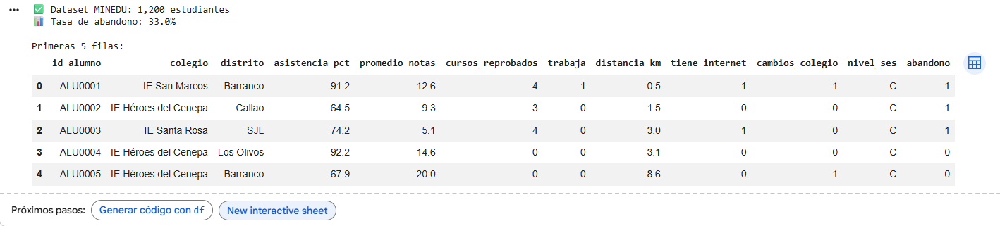
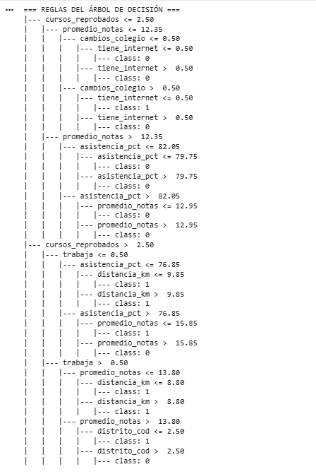
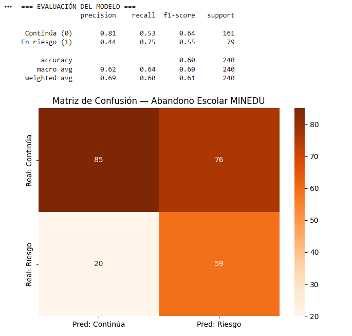
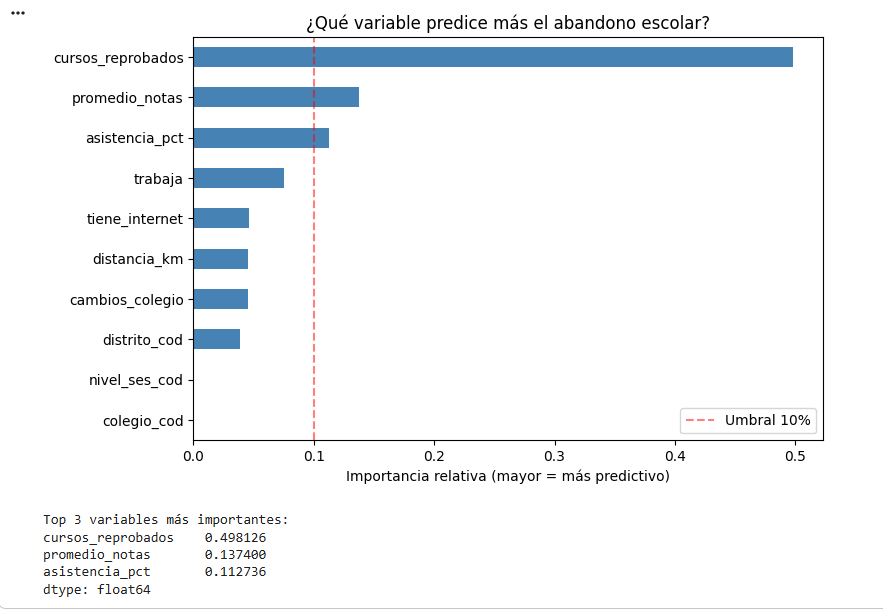

# S6 — LABORATORIO DE CLASE: Tu Primer Modelo de ML en 35 Minutos

## Big Data DD283 | Universidad Autónoma del Perú | 2026-1

### Semana 6: Predicción de Estudiantes en Riesgo con scikit-learn

---

> **Este laboratorio se realiza DURANTE la clase bajo supervisión del docente**
> **Tiempo: 35 minutos | Individual**
> **Herramienta: Google Colab (solo necesitas tu cuenta Google)**

---

| Campo                     | Detalle                      |
| ------------------------- | ---------------------------- |
| **Nombre del estudiante** | JUNIOR EMERZON ORTIZ ANDRADE |
| **Código**                | 2221895332                   |
| **Fecha**                 | 11/07/2026                   |

---

## ACCESO AL ENTORNO (2 minutos)

1. Abre el navegador → ve a **colab.research.google.com**
2. Inicia sesión con tu cuenta Google
3. Haz clic en **"+ Nuevo notebook"**
4. Renombra el archivo: `S6_Lab_Clase_TuNombre`
5. En la primera celda, ejecuta:

```python
import sklearn, pandas, numpy
print(f"✅ scikit-learn {sklearn.__version__} | pandas {pandas.__version__} | numpy {numpy.__version__}")
```

**¿Ves ✅ con 3 versiones? → Listo para empezar.**

---

## CONTEXTO

Eres analista de datos del **MINEDU** (Ministerio de Educación del Perú). El director regional quiere identificar estudiantes en riesgo de abandono escolar para asignar tutores de apoyo. Tienes datos de 1,200 estudiantes del último año. Tu tarea: entrenar un modelo de Machine Learning que prediga quiénes están en riesgo.

---

## PASO 1 — Cargar el dataset y explorar (7 min)

```python
# ============================================================
# CELDA 1: Dataset MINEDU — ejecutar sin modificar
# ============================================================
import pandas as pd
import numpy as np
from sklearn.tree import DecisionTreeClassifier, export_text
from sklearn.model_selection import train_test_split
from sklearn.metrics import classification_report, confusion_matrix
import matplotlib.pyplot as plt
import seaborn as sns
np.random.seed(42)

N = 1200
colegios = ["José María Arguedas", "Colegio Nacional Lima", "IE Santa Rosa",
            "IE San Marcos", "IE Héroes del Cenepa"]
distritos = ["Ate", "SJL", "Villa El Salvador", "Los Olivos",
             "Miraflores", "Barranco", "Comas", "Callao"]

df = pd.DataFrame({
    "id_alumno":         [f"ALU{i:04d}" for i in range(1, N+1)],
    "colegio":           np.random.choice(colegios, N),
    "distrito":          np.random.choice(distritos, N),
    "asistencia_pct":    np.round(np.random.beta(8, 2, N) * 100, 1),
    "promedio_notas":    np.round(np.random.normal(12.5, 3.2, N).clip(0, 20), 1),
    "cursos_reprobados": np.random.randint(0, 7, N),
    "trabaja":           np.random.choice([0, 1], N, p=[0.75, 0.25]),
    "distancia_km":      np.round(np.random.exponential(8, N), 1),
    "tiene_internet":    np.random.choice([0, 1], N, p=[0.40, 0.60]),
    "cambios_colegio":   np.random.choice([0, 1, 2, 3], N, p=[0.7, 0.15, 0.1, 0.05]),
    "nivel_ses":         np.random.choice(["A/B", "C", "D/E"], N, p=[0.20, 0.40, 0.40]),
})

# Variable objetivo: abandono escolar
prob_abandono = (
    0.02 +
    (1 - df["asistencia_pct"] / 100) * 0.40 +
    df["cursos_reprobados"] * 0.08 +
    df["trabaja"] * 0.12 +
    df["cambios_colegio"] * 0.06 -
    (df["promedio_notas"] - 10) * 0.02 -
    df["tiene_internet"] * 0.04
).clip(0.01, 0.90)
df["abandono"] = (np.random.random(N) < prob_abandono).astype(int)

print(f"✅ Dataset MINEDU: {len(df):,} estudiantes")
print(f"📊 Tasa de abandono: {df['abandono'].mean():.1%}")
print(f"\nPrimeras 5 filas:")
df.head()
```

**PUNTO DE VERIFICACIÓN 1:** ¿Ves "1,200 estudiantes" y una tasa de abandono entre 8% y 15%? → Continúa.

---

**Evidencia — Celda 1:** dataset MINEDU cargado (1,200 estudiantes)



## PASO 2 — Entrenar el modelo (20 min)

```python
# ============================================================
# CELDA 2: Preprocesamiento básico
# ============================================================
from sklearn.preprocessing import LabelEncoder

df_modelo = df.copy()

# Codificar variables categóricas
for col in ["colegio", "distrito", "nivel_ses"]:
    le = LabelEncoder()
    df_modelo[col + "_cod"] = le.fit_transform(df_modelo[col])

features = ["asistencia_pct", "promedio_notas", "cursos_reprobados",
            "trabaja", "distancia_km", "tiene_internet", "cambios_colegio",
            "colegio_cod", "distrito_cod", "nivel_ses_cod"]

X = df_modelo[features]
y = df_modelo["abandono"]

# Dividir train/test
X_train, X_test, y_train, y_test = train_test_split(
    X, y, test_size=0.20, random_state=42, stratify=y
)
print(f"✅ Entrenamiento: {len(X_train)} | Prueba: {len(X_test)}")
print(f"   Abandono en train: {y_train.mean():.1%}")
print(f"   Abandono en test:  {y_test.mean():.1%}")
```

**Evidencia — Celda 2:** preprocesamiento y division train/test (960 / 240)


```python
# ============================================================
# CELDA 3: ▶ TU TURNO — Entrenar el árbol de decisión
# ============================================================
from sklearn.tree import DecisionTreeClassifier, export_text

# Crear el árbol de decisión
arbol = DecisionTreeClassifier(
    max_depth=4,               # ← Profundidad máxima
    min_samples_leaf=15,       # ← Mínimo de alumnos por hoja
    class_weight="balanced",   # ← Para datos desbalanceados
    random_state=42
)

# Entrenar el modelo
arbol.fit(X_train, y_train)     # ← Método para entrenar

# Ver las reglas aprendidas por el árbol
print("=== REGLAS DEL ÁRBOL DE DECISIÓN ===")
print(export_text(arbol, feature_names=features))
```

_Pistas:_

- `max_depth=___` → `4`
- `min_samples_leaf=___` → `15`
- `class_weight="___"` → `"balanced"`
- `arbol.___(X_train, y_train)` → `fit`

**PUNTO DE VERIFICACIÓN 2:** ¿Aparecen las reglas del árbol con `|--- asistencia_pct` o `cursos_reprobados`? → Bien entrenado.

**Evidencia — Celda 3:** reglas aprendidas por el arbol de decision



```python
# ============================================================
# CELDA 4: Evaluar el modelo
# ============================================================

# Predecir sobre datos de prueba
y_pred = arbol.predict(X_test)          # ← fit entrena, predict predice

# Reporte de métricas
print("=== EVALUACIÓN DEL MODELO ===")
print(classification_report(
    y_test,                             # ← valores reales
    y_pred,                             # ← valores predichos
    target_names=["Continúa (0)", "En riesgo (1)"],
    zero_division=0
))

# Matriz de confusión visual
cm = confusion_matrix(y_test, y_pred)
sns.heatmap(cm, annot=True, fmt='d', cmap='Oranges',
            xticklabels=["Pred: Continúa", "Pred: Riesgo"],
            yticklabels=["Real: Continúa", "Real: Riesgo"])
plt.title("Matriz de Confusión — Abandono Escolar MINEDU")
plt.tight_layout()
plt.show()
```

_Pistas:_

- `arbol.___(X_test)` → `predict`
- `classification_report(___, ___, ...)` → `y_test, y_pred`

**PUNTO DE VERIFICACIÓN 3:** ¿Ves el reporte con Precision y Recall para "En riesgo (1)"? ¿Aparece la matriz de confusión en colores? → Continúa.

**Evidencia — Celda 4:** metricas de evaluacion y matriz de confusion



```python
# ============================================================
# CELDA 5: Importancia de variables — ¿qué predice el abandono?
# ============================================================

importancias = pd.Series(
    arbol.feature_importances_,
    index=features
).sort_values(ascending=True)

importancias.plot(kind="barh", color="steelblue", figsize=(8, 5))
plt.title("¿Qué variable predice más el abandono escolar?")
plt.xlabel("Importancia relativa (mayor = más predictivo)")
plt.axvline(x=0.10, color='red', linestyle='--', alpha=0.5, label='Umbral 10%')
plt.legend()
plt.tight_layout()
plt.show()

print("\nTop 3 variables más importantes:")
print(importancias.tail(3)[::-1])
```

---

**Evidencia — Celda 5:** importancia de variables (Top 3)



## PASO 3 — Pregunta de análisis final (5 min)

```python
# ============================================================
# CELDA 6: Escribe tus respuestas como comentarios Python
# ============================================================

pregunta_1 = """
Según el gráfico de importancia de variables (Celda 5):
¿Cuál es LA variable que más predice el abandono escolar?
¿Tiene sentido desde el punto de vista educativo? ¿Por qué?

# Tu respuesta:
La variable mas predictiva es CURSOS_REPROBADOS, con una importancia
de 0.498 (casi el 50% del poder predictivo del modelo). Es tambien la
raiz del arbol: la primera pregunta que hace es "cursos_reprobados <= 2.5".
Le siguen promedio_notas (0.137) y asistencia_pct (0.113).

Si tiene sentido educativo: reprobar cursos es un indicador ACUMULATIVO
de fracaso academico. Un alumno con 3 o mas cursos jalados arrastra
repitencia, desmotivacion y desfase de edad-grado, factores que el MINEDU
ya reconoce como predictores de desercion. Ademas, a diferencia de la
asistencia (que varia mes a mes), los cursos reprobados son un dato duro
que la IE ya registra: el modelo es aplicable sin recolectar nada nuevo.
"""

pregunta_2 = """
Mira la Matriz de Confusión (Celda 4):
¿Cuántos estudiantes en RIESGO REAL fueron clasificados como
'Continúa' (Falsos Negativos)?

Si el MINEDU quiere asignar tutores a los estudiantes en riesgo,
¿eso es un problema grave? ¿Por qué sí o por qué no?

# Tu respuesta:
En mi matriz de confusion hay 20 FALSOS NEGATIVOS: 20 estudiantes que
SI estaban en riesgo real de abandono, pero el modelo los clasifico como
"Continua". De 79 alumnos en riesgo real, el modelo detecto 59
(Recall = 59/79 = 0.75) y se le escaparon 20.

SI es un problema grave. Un Falso Negativo significa que ese alumno NO
recibe tutor y abandona el colegio sin que nadie lo haya detectado: es un
error IRREVERSIBLE. En cambio un Falso Positivo (tuve 76) solo significa
asignar un tutor a alguien que quizas no lo necesitaba: cuesta recursos,
pero no destruye una trayectoria escolar.

Por eso en este problema priorizamos RECALL sobre PRECISION, y por eso se
uso class_weight="balanced". El costo de los dos errores NO es simetrico.
Nota: mi accuracy es 0.60, pero esa metrica es enganosa aqui; lo que
importa es el recall de la clase "En riesgo".
"""

pregunta_3 = """
El modelo fue entrenado con datos de 8 distritos de Lima.
Si el MINEDU lo quisiera usar en Pucallpa (selva), ¿qué
problema podría ocurrir? (Pista: recuerda los tipos de sesgo
que vimos en la sesión de hoy)

# Tu respuesta (en 2-3 líneas):
Ocurriria un SESGO DE SELECCION / MUESTREO: el modelo se entreno solo con
8 distritos de Lima urbana, por lo que aprendio patrones que no representan
la realidad amazonica. De hecho, mi arbol usa "distrito_cod" como criterio
de decision, y en Pucallpa esos codigos no significan nada.

Ademas hay DESPLAZAMIENTO DE DOMINIO (dataset shift): variables como
distancia_km o tiene_internet tienen distribuciones y significados
completamente distintos en la selva (rios, lluvias, falta de cobertura),
y alli operan causas de abandono que el modelo nunca vio (trabajo agricola
estacional, migracion, lengua materna distinta al castellano). El modelo
subestimaria el riesgo y dejaria sin tutor a alumnos vulnerables.
Se debe reentrenar con datos locales de Ucayali antes de usarlo.
"""

print(pregunta_1)
print(pregunta_2)
print(pregunta_3)
```

---

## ROL DEL DOCENTE DURANTE EL LABORATORIO

### Qué observar al circular por el aula

| Señal positiva                                                                 | Señal de alerta                                                 | Acción del docente                                                                                                              |
| ------------------------------------------------------------------------------ | --------------------------------------------------------------- | ------------------------------------------------------------------------------------------------------------------------------- |
| "1,200 estudiantes" en Celda 1 + tasa 8-15%                                    | Error de importación o celda no ejecutada                       | "¿Ejecutaste las celdas en orden? Ctrl+Enter en cada celda. Las importaciones de la Celda 1 son necesarias para las siguientes" |
| Reglas del árbol en Celda 3 con `\|---`                                        | `AttributeError: DecisionTreeClassifier has no attribute 'fit'` | "Revisa el último `___` — el método para entrenar se llama `fit`, no `train`"                                                   |
| Reporte con Precision y Recall en Celda 4                                      | Todos los valores de Recall = 0.00                              | "¿Pusiste `class_weight='balanced'`? Sin eso, el modelo puede ignorar la clase minoritaria"                                     |
| Matriz de confusión coloreada visible                                          | `ValueError: classification_report`                             | "¿Los argumentos están en el orden correcto? Primero `y_test` (real), luego `y_pred` (predicho)"                                |
| Top 3 variables con `asistencia_pct` o `cursos_reprobados` como más importante | Todas las importancias ≈ 0 o iguales                            | "¿El árbol entrenó correctamente? Ejecuta `print(arbol.get_depth())` — si es 0, hay un error en el fit"                         |

### Preguntas de andamiaje

\_Para el estudiante que completa los `___` pero no entiende por qué:\_

- _"El método `fit(X, y)` ajusta los parámetros del árbol. ¿Cuál es X (las variables de entrada)? ¿Cuál es y (lo que queremos predecir)?"_

_Para el estudiante que tiene Recall de En riesgo = 0:_

- _"Si la tasa de abandono es 12%, ¿cuántas filas de clase 1 hay en X_train? ¿El árbol vio suficientes ejemplos de abandono para aprender? Prueba añadiendo `class_weight='balanced'`"_

_Para el estudiante que terminó antes:_

- _"Prueba con `max_depth=2` en lugar de 4. ¿Las reglas son más simples? ¿Mejora o empeora el F1? ¿Cómo se llama ese fenómeno (underfitting/overfitting)?"_

### Señales de comprensión vs. no comprensión

**Entendió:**

- Puede explicar qué es un FN en este contexto: "predije que el alumno NO iba a abandonar pero sí abandonó"
- Dice que `asistencia_pct` tiene sentido como predictor más fuerte: "claro, si falta mucho, tiene más riesgo"

**No entendió:**

- Cree que alta accuracy significa buen modelo: "tengo 90% de accuracy, está perfecto" — sin mirar el Recall de la clase riesgo
- Confunde `fit` y `predict`: "¿para qué son los dos métodos si hago lo mismo?"

### Cierre del laboratorio (5 min — pregunta al grupo)

```
"Levanten la mano: ¿cuántos obtuvieron F1 de 'En riesgo' mayor a 0.40?"
→ Quienes no: revisar si pusieron class_weight='balanced'

"¿Cuál variable salió más importante en su modelo?"
→ Respuesta esperada: asistencia_pct o cursos_reprobados
→ Si alguien dice nivel_ses_cod: "¿Por qué podría ser problemático usar eso?
   ¿Qué tipo de sesgo introduce?" (conecta con la sesión de hoy)

"Pregunta de cierre: ¿Recomendarían a la UGEL Lima publicar este modelo
en su página web para que los padres vean si su hijo está en 'alto riesgo'?
¿Por qué sí o no?"
→ Esperar respuestas — conecta con el debate de transparencia y
   profecías autocumplidas de la sesión de teoría.
```

---

## ENTREGABLE EN CLASE

Al finalizar los 35 minutos, el estudiante muestra al docente:

1. **Pantalla:** 6 celdas ejecutadas sin errores (la barra izquierda de cada celda tiene ✓)
2. **La matriz de confusión** visible en Celda 4 con números reales
3. **Verbalmente:** responde — _"¿Cuál variable predice más el abandono en tu modelo?"_ + _"¿Qué es un Falso Negativo en este contexto?"_

**El docente marca ✓ en su lista si el estudiante responde ambas preguntas correctamente.**

---

_Big Data DD283 | Universidad Autónoma del Perú | Semana 6 | 2026-1_
_Laboratorio de Clase — Ejecutar durante la sesión presencial_
